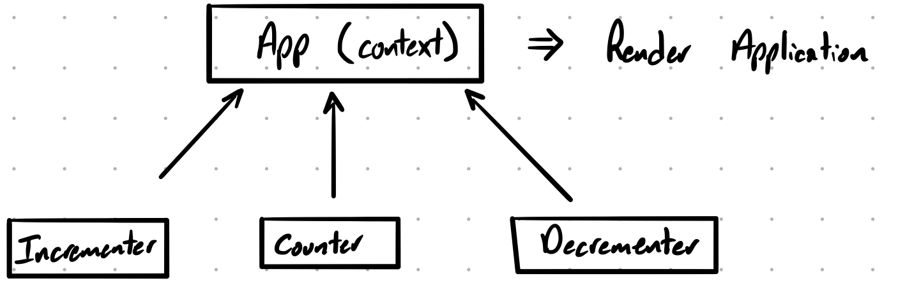

#  LAB

## Counter

### Author: Jagdeep Singh

### Links and Resources

- [submission PR](https://github.com/401-advanced-javascript-js/lab-33-counter-contextAPI/pull/1)
- [travis](https://travis-ci.com/401-advanced-javascript-js/lab-33-counter-contextAPI)
- [front-end](http://xyz.com) (when applicable)

#### Documentation

- [styleguide](http://xyz.com) (React assignments)

<!-- ### Modules

#### `modulename.js`

##### Exported Values and Methods

###### `foo(thing) -> string`

Usage Notes or examples

###### `bar(array) -> array`

Usage Notes or examples -->

### Setup

#### Running the app

- `npm run start`

#### Tests

- How do you run tests? `npm test`

#### UML

